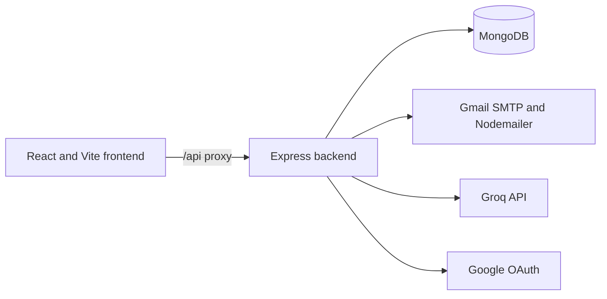

# Schedulfy

Schedulfy is a productivity and team-collaboration application. It combines personal task management with shared workspaces, projects, task assignment, email invitations, activity notifications, password recovery, Google sign-in, and an AI productivity assistant.

## Contents

- [What It Does](#what-it-does)
- [Architecture](#architecture)
- [Repository Layout](#repository-layout)
- [Technology](#technology)
- [Local Setup](#local-setup)
- [Environment Variables](#environment-variables)
- [Authentication](#authentication)
- [Password Reset](#password-reset)
- [Workspaces and Invitations](#workspaces-and-invitations)
- [Projects and Tasks](#projects-and-tasks)
- [Notifications](#notifications)
- [AI Insights](#ai-insights)
- [API Reference](#api-reference)
- [Data Models](#data-models)
- [Security](#security)
- [Troubleshooting](#troubleshooting)
- [Fix History](#fix-history)
- [Validation](#validation)
- [Known Limitations](#known-limitations)
- [Deployment](#deployment)

## What It Does

Schedulfy supports these workflows:

- Register and log in with email and password.
- Optionally authenticate through Google OAuth.
- Request and complete a password reset by email.
- Create and manage workspaces.
- Invite teammates by email.
- Accept invitations from the recipient's own account.
- Create projects inside shared workspaces.
- Create and assign tasks to workspace members.
- Track task status, priority, due dates, tags, and completion.
- Display workspace activity in a notification panel.
- Ask an AI assistant about workload, priorities, and task actions.
- View dashboard, calendar, focus, projects, team, templates, settings, and Insights screens.

## Architecture



### Frontend

The React application is in `schedulfy/`. Vite serves it during development. Requests to `/api` are proxied to `http://localhost:5000` by `schedulfy/vite.config.js`.

Important frontend areas:

- `src/pages/`: route-level screens.
- `src/components/`: reusable UI components.
- `src/context/`: shared authentication, task, and event state.
- `src/lib/AuthContext.jsx`: JWT session state and current-user loading.
- `src/lib/sdk.js`: shared API client.
- `src/api/schedulfyClient.js`: alternate API helper.

### Backend

The active API is `backend/src/server.js`. It loads environment variables, configures CORS and JSON parsing, registers routes, connects to MongoDB, and starts port `5000`.

Important backend areas:

- `src/Routes/`: HTTP route handlers.
- `src/models/`: Mongoose schemas.
- `src/services/emailService.js`: SMTP and email templates.
- `src/services/groqService.js`: Groq prompts and structured responses.
- `src/services/notificationService.js`: activity notification creation.
- `src/middleware/auth.js`: JWT verification.

The repository-root `server.js` is a separate legacy/local server and is not the current API used by the React app.

## Repository Layout

```text
.
├── README.md
├── package.json
├── server.js                 Legacy/local server
├── backend/
│   ├── .env
│   ├── package.json
│   └── src/
│       ├── server.js         Active Express API
│       ├── controllers/
│       ├── middleware/
│       ├── models/
│       ├── Routes/
│       └── services/
├── data/
└── schedulfy/
    ├── package.json
    ├── vite.config.js
    └── src/
        ├── api/
        ├── components/
        ├── context/
        ├── lib/
        ├── pages/
        └── services/
```

## Technology

- React, React Router, Vite, Tailwind CSS
- Recharts, Lucide React, date-fns, react-markdown
- Node.js ES modules, Express, MongoDB, Mongoose
- JSON Web Tokens and bcryptjs
- Nodemailer and Gmail SMTP
- Groq SDK
- Helmet, CORS, and express-rate-limit

## Local Setup

### Prerequisites

- Node.js 18 or newer
- npm
- MongoDB locally or a MongoDB connection string
- Gmail app password for email delivery
- Groq API key for Insights
- Google OAuth credentials if Google login is required

### Install

```powershell
cd backend
npm install

cd ..\schedulfy
npm install
```

### Start the backend

```powershell
cd C:\Users\Pince Baffs\Desktop\Prodcutivityapp\backend
npm run dev
```

The API runs at `http://localhost:5000`.

### Start the frontend

In a second terminal:

```powershell
cd C:\Users\Pince Baffs\Desktop\Prodcutivityapp\schedulfy
npm run dev
```

The frontend normally runs at `http://localhost:5173`. If that port is busy, Vite may use `5174`.

Do not start a second backend while port `5000` is occupied. `EADDRINUSE` means another server is already using that port.

### Root scripts

```powershell
npm run dev       # Start the frontend through schedulfy
npm run build     # Build the frontend
npm run preview   # Preview the frontend build
npm run dev:api   # Start the separate legacy root server
```

For normal development, start the backend from `backend/` and the frontend from `schedulfy/`.

## Environment Variables

Create `backend/.env`:

```env
PORT=5000
MONGODB_URI=mongodb://localhost:27017/schedulfy
JWT_SECRET=replace-with-a-long-random-secret
NODE_ENV=development
FRONTEND_URL=http://localhost:5173
COMPANY_NAME=Schedulfy

SMTP_HOST=smtp.gmail.com
SMTP_PORT=587
SMTP_SECURE=false
SMTP_USER=your-sender@gmail.com
SMTP_PASS=your-gmail-app-password

GROQ_API_KEY=your-groq-api-key
AI_MODEL=openai/gpt-oss-20b
AI_TEMPERATURE=0.3
AI_MAX_TOKENS=1024

GOOGLE_CLIENT_ID=
GOOGLE_CLIENT_SECRET=
GOOGLE_REDIRECT_URI=http://localhost:5000/api/auth/google/callback
```

Gmail requires an app password when two-step verification is enabled. Never commit real passwords, API keys, OAuth secrets, or Gmail app passwords. Rotate credentials that have been exposed.

### Google OAuth configuration

In Google Cloud Console, add these authorized JavaScript origins:

```text
http://localhost:5173
http://localhost:5174
```

Add this authorized redirect URI:

```text
http://localhost:5000/api/auth/google/callback
```

Google login remains disabled when the client ID and secret are empty.

## Authentication

### Email and password

1. The frontend sends credentials to `POST /api/auth/login`.
2. The backend finds the user by lowercase email.
3. bcrypt compares the submitted password with the stored hash.
4. The backend signs a JWT containing the user ID.
5. The frontend stores it as `authToken`.
6. Protected requests send `Authorization: Bearer <token>`.
7. The auth middleware verifies the token and sets `req.userId`.

Registration requires a name, email, and password of at least six characters. The User model hashes passwords in a Mongoose `pre('save')` hook.

`GET /api/auth/me` returns the current user without the password.

### Google login

The login page sends the browser to `GET /api/auth/google`. The backend redirects to Google, exchanges the authorization code, retrieves the Google profile, finds or creates a local User by email, signs a Schedulfy JWT, and redirects back to `/login` with a temporary token. The frontend stores the token through `AuthContext`.

## Password Reset

### Request

The Forgot Password page calls `POST /api/auth/forgot-password`.

The backend always returns the same public message whether or not the account exists. This prevents account enumeration. For a matching account it:

1. Generates a random token.
2. Stores only its SHA-256 hash.
3. Sets a 30-minute expiry.
4. Sends a reset email using Nodemailer.

### Complete reset

The email links to `/reset-password?token=<token>`. The page calls `POST /api/auth/reset-password` with the token and new password.

The backend checks the hashed token and expiry, saves the new password through bcrypt, and clears the reset fields. The token is single-use.

## Workspaces and Invitations

### Workspace creation

`POST /api/workspace` creates a Workspace with a name, description, admin ID, invite code, and initial member ID. If a user has no workspace, the workspace list endpoint creates a default Schedulfy workspace.

### Sending an invitation

`POST /api/workspace/:workspaceId/invite`:

1. Requires authentication.
2. Normalizes and validates the email.
3. Checks DNS mail records for the domain.
4. Confirms the inviter belongs to the workspace.
5. Creates a secure seven-day invitation token.
6. Stores the invitation.
7. Sends an email containing `/accept-invite?token=<token>`.

### Accepting an invitation

The recipient must authenticate first. The backend checks that the token exists, is unaccepted, is not expired, and belongs to the current account email. It then adds the user ID to `member_ids` and marks the invitation accepted.

## Projects and Tasks

### Projects

A project stores its owner, workspace, name, description, color, status, and due date. Workspace members can see shared projects. Project deletion is owner-only.

Older owner projects without a workspace ID are associated with the owner’s first workspace when projects are loaded.

### Task fields

Tasks can contain:

- `title`, `description`
- `status`, `priority`, `due_date`, `tags`
- `user_id` for the creator
- `workspace_id` for shared access
- `project_id` for project membership
- `assignee_id`, `assignee_name`, `assignee_avatar`
- `is_ai_generated`, `created_at`, `updated_at`

### Task creation and assignment

`POST /api/tasks` confirms the creator belongs to the workspace and validates the assignee as a workspace member. Project-created tasks include both `project_id` and `workspace_id`.

`GET /api/tasks` returns tasks where the user is the creator, direct assignee, or workspace member. Direct assignee access is included to support older records with incomplete workspace metadata.

`PUT /api/tasks/:id` validates shared-task access and assignee membership. Project screens normalize MongoDB `_id` values to frontend `id` values.

## Notifications

Notifications are stored in MongoDB and scoped to the recipient. The service normally notifies workspace members while excluding the actor. Assignment notifications can target only the assignee.

Events include:

- New task created
- Task assigned
- Task status changed
- Task completed
- New project created
- Project updated
- New member joined

Each notification contains recipient, workspace, type, title, message, actor name, related entity, read state, and creation time.

The panel loads the newest 50 notifications with `GET /api/notifications` and supports:

```text
PATCH /api/notifications/:id/read
PATCH /api/notifications/read-all
```

Old notifications created before actor tracking may not contain an actor name.

## AI Insights

The Insights page sends natural-language requests to `POST /api/ai/command`.

The backend verifies the user, loads personal tasks, assigned tasks, and shared workspace tasks, then sends that context to Groq. Groq returns structured JSON that the frontend displays or executes through `POST /api/ai/execute`.

Supported intent types include:

- `query`: list or analyze tasks.
- `create`: propose a new task.
- `update`: propose changes.
- `delete`: propose deletion and require confirmation.
- `unknown`: ask for clarification.

The AI routes are rate-limited. The model is configured with `AI_MODEL`. If Groq returns `model_not_found`, select a model available to the configured API key.

## API Reference

Protected routes require:

```http
Authorization: Bearer <jwt>
```

### Auth

```text
GET  /api/auth/test
POST /api/auth/register
POST /api/auth/login
GET  /api/auth/me
GET  /api/auth/health
GET  /api/auth/google
GET  /api/auth/google/callback
POST /api/auth/forgot-password
POST /api/auth/reset-password
```

### Workspaces

```text
GET  /api/workspace
POST /api/workspace
GET  /api/workspace/:workspaceId
POST /api/workspace/:workspaceId/invite
POST /api/workspace/accept-invite
```

### Projects

```text
GET    /api/projects
POST   /api/projects
PATCH  /api/projects/:id
DELETE /api/projects/:id
```

### Tasks

```text
GET    /api/tasks
POST   /api/tasks
PUT    /api/tasks/:id
DELETE /api/tasks/:id
```

### Notifications

```text
GET   /api/notifications
PATCH /api/notifications/:id/read
PATCH /api/notifications/read-all
```

### AI

```text
POST /api/ai/command
POST /api/ai/execute
```

## Data Models

### User

Stores name, lowercase email, bcrypt password hash, creation time, and temporary password-reset fields.

### Workspace

Stores name, description, admin ID, invite code, member IDs, invitation records, and timestamps. Invitations store email, token, inviter, creation time, expiry, and accepted state.

### Project

Stores name, description, color, status, due date, owner ID, workspace ID, and creation time.

### Task

Stores content, workflow state, priority, due date, tags, creator, workspace, project, assignee, and timestamps.

### Notification

Stores recipient, workspace, type, title, message, actor, related entity, read state, and creation time.

## Security

- Passwords are hashed with bcrypt.
- Protected routes require JWT authentication.
- Reset tokens are hashed, expire after 30 minutes, and are single-use.
- Forgot-password responses do not reveal whether an email exists.
- Invitation acceptance requires the invited email account.
- Assignees must be workspace members.
- Project deletion is owner-only.
- AI routes are rate-limited.
- SMTP, Groq, and OAuth secrets remain backend-only.
- Recipient domain checks help catch mistyped invitation addresses.

## Troubleshooting

### `EADDRINUSE :::5000`

Another backend process owns port `5000`:

```powershell
Get-NetTCPConnection -LocalPort 5000
Get-CimInstance Win32_Process -Filter "Name = 'node.exe'" | Select-Object ProcessId,CommandLine
Stop-Process -Id <PID> -Force
```

Stop only the duplicate process, then start the backend from `backend/`.

### Vite uses port 5174

Port `5173` is occupied. Use the URL printed by Vite or stop the old frontend process.

### Frontend loads but API requests fail

Check that the backend is running on `5000`, the frontend proxy is active, `schedulfy/src/lib/sdk.js` uses `/api`, and a valid `authToken` exists in local storage.

### Invitation email is accepted but not received

Check the exact address, spam folder, SMTP credentials, and recipient domain. SMTP acceptance does not guarantee inbox delivery.

### `Greeting never received`

This is an SMTP connection timeout. The email service uses connection, greeting, and socket timeouts plus retry handling. Confirm port `587` is reachable and restart the backend after changing `.env`.

### Google sign-in is not configured

Set `GOOGLE_CLIENT_ID` and `GOOGLE_CLIENT_SECRET`, then add the matching origins and callback URI in Google Cloud Console.

### Password reset email is missing

Check SMTP settings, spam, and the exact account email. The API intentionally returns the same response for unknown emails.

### AI model errors

Check `GROQ_API_KEY` and use a model ID available to that account. Restart the backend after changing `AI_MODEL`.

## Fix History

The following major issues were identified and fixed during development:

- Replaced the invitation route’s console-only mock sender with Gmail SMTP.
- Added Nodemailer to the backend package instead of the wrong workspace package.
- Removed redundant SMTP verification and added timeout/retry handling.
- Added recipient-domain validation for mistakes such as `gamail.com`.
- Replaced hard-coded workspaces and invitation acceptance with MongoDB persistence.
- Added authenticated invitation acceptance and membership checks.
- Added workspace-aware projects, tasks, and assignees.
- Added missing task fields such as `project_id` and assignee display fields.
- Fixed the frontend task SDK base URL that prevented assigned tasks from loading.
- Added direct assignee visibility for older task records.
- Replaced Base44 notification placeholders with MongoDB notification routes.
- Added actor names to activity notifications.
- Replaced hard-coded Insights replies with Groq-backed responses.
- Corrected the AI task query from `userId` to `user_id`.
- Selected a Groq model available to the configured account.
- Added password visibility and Google OAuth wiring.
- Added the missing password reset backend flow.
- Improved login contrast and added a centered login layout.

## Validation

### Frontend build

```powershell
cd schedulfy
npm run build
```

### Backend module check

```powershell
cd backend
node -e "Promise.all([import('./src/Routes/auth.js'), import('./src/Routes/tasks.js')]).then(() => console.log('Backend modules loaded'))"
```

### API health check

```powershell
Invoke-WebRequest http://localhost:5000/api/test
```

### Manual end-to-end test

1. Register and log in.
2. Create or load a workspace.
3. Invite a second account.
4. Accept the invitation from the recipient account.
5. Create a project and task as the owner.
6. Assign the task to the invited member.
7. Confirm the member sees it in Tasks and Projects.
8. Open Notifications and verify the actor and action.
9. Mark the task done and verify the completion notification.
10. Open Insights and ask for a workload summary.
11. Request a password reset and complete it from the email link.

## Known Limitations

- Historical notifications may not have actor names.
- Older records may need migration or first-load workspace association.
- Google OAuth requires external Google Cloud configuration.
- Email delivery depends on SMTP provider and recipient mailbox configuration.
- The root `server.js` remains a separate legacy server.
- Some pre-existing unused-import diagnostics remain, although the production build succeeds.
- A complete automated integration-test suite has not yet been added; important flows were validated through live API checks.

## Deployment

For deployment:

1. Provision MongoDB.
2. Configure backend environment variables in the hosting provider.
3. Use a verified SMTP or transactional email provider.
4. Add the deployed frontend origin to CORS and Google OAuth settings.
5. Set `FRONTEND_URL` to the deployed frontend URL.
6. Set `GOOGLE_REDIRECT_URI` to the deployed backend callback URL.
7. Build the frontend with `npm run build`.
8. Keep secrets out of the frontend bundle and repository.

The local Vite proxy targets `http://localhost:5000`. Production should set `VITE_API_URL` or use a reverse proxy for the deployed API.
